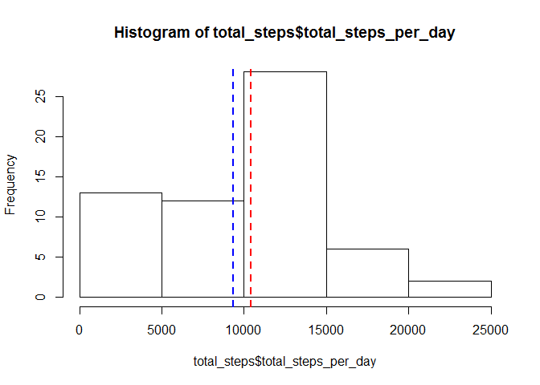
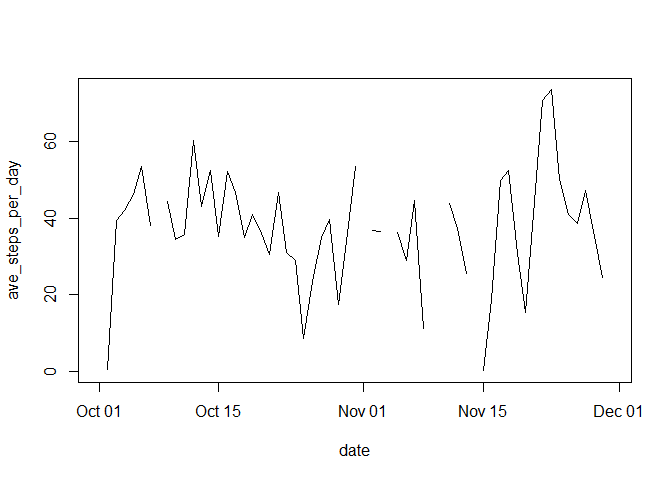
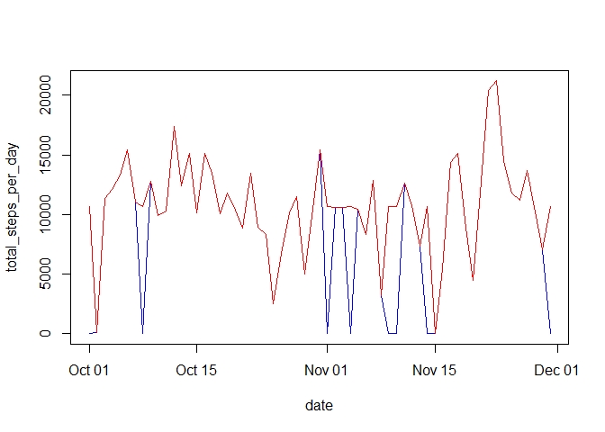
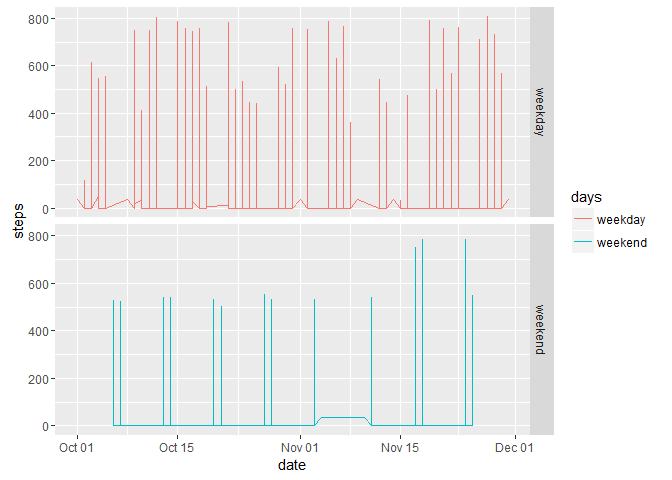

# Reproducible Research: Peer Assessment 1


## Loading and preprocessing the data
load required library

```r
library(dplyr)
```

```
## 
## Attaching package: 'dplyr'
## 
## The following objects are masked from 'package:stats':
## 
##     filter, lag
## 
## The following objects are masked from 'package:base':
## 
##     intersect, setdiff, setequal, union
```

Load data

```r
activity <- read.csv("activity.csv")
```

convert "date" from factor to date data type

```r
activity$date <- as.Date(activity$date)
```

## What is mean total number of steps taken per day?
group data by date

```r
activity_grp <- group_by(activity, date)
```

then, calculate total of steps for each day

```r
total_steps <- summarise(activity_grp, total_steps_per_day = sum(steps, na.rm = TRUE))
```

find the mean

```r
mean(total_steps$total_steps_per_day)
```

```
## [1] 9354.23
```
find the median

```r
median(total_steps$total_steps_per_day)
```

```
## [1] 10395
```

draw histogram and add the mean and median

```r
hist(total_steps$total_steps_per_day)
abline(v = mean(total_steps$total_steps_per_day), lwd = 2, lty = 2, col = "blue")	  
abline(v = median(total_steps$total_steps_per_day), lwd = 2, lty = 2, col = "red")
```

 


## What is the average daily activity pattern?
find the average steps

```r
ave_steps <- summarise(activity_grp, ave_steps_per_day = mean(steps, na.rm = TRUE))
```

then plot

```r
plot(ave_steps_per_day ~ date, ave_steps, type = "l")
```

 

find max. ave. steps

```r
max(ave_steps$ave_steps_per_day[complete.cases(ave_steps)])
```

```
## [1] 73.59028
```
then find the date with max. ave.

```r
na.omit(ave_steps[ave_steps$ave_steps_per_day>=73,])
```

```
## Source: local data frame [1 x 2]
## 
##         date ave_steps_per_day
##       (date)             (dbl)
## 1 2012-11-23          73.59028
```

## Imputing missing values
find the total number of missing values in the dataset

```r
sum(is.na(activity$steps))
```

```
## [1] 2304
```

find the ave. steps and use it for missing values

```r
m <- as.integer(mean(ave_steps$ave_steps_per_day, na.rm = TRUE))
```

function to create new dataset

```r
fill_miss_values <- function(){
	## copy "activity" data frame
	updated_activity <- activity
	## get the average steps of all days, as integer
	m <- as.integer(mean(ave_steps$ave_steps_per_day, na.rm = TRUE))
	##[1] 37

	for(i in seq_len(nrow(updated_activity))) {
		## if steps are na
		if(is.na(updated_activity$steps[i])){
			## replace it with average steps
			updated_activity$steps[i] <- m
		}
	}
	## return updated activity
	updated_activity
}

updated_activity <- fill_miss_values()
```

Compare between old dataset and new dataset
group data by date

```r
updated_activity_grp <- group_by(updated_activity, date)
```

calculate total of steps for each day

```r
updated_total_steps <- summarise(updated_activity_grp, total_steps_per_day = sum(steps, na.rm = TRUE))
```

find mean and median (notice: both are higher than the estimates in first part)

```r
mean(updated_total_steps$total_steps_per_day)
```

```
## [1] 10751.74
```

```r
median(updated_total_steps$total_steps_per_day)
```

```
## [1] 10656
```

plot both datasets to show the impact of imputing missing data

```r
## original data:
plot(total_steps_per_day ~ date, total_steps, type = "l", col = "blue")
## updated data:
lines(total_steps_per_day ~ date, updated_total_steps, col = "red")
```

 
it shows both are mostly identical


## Are there differences in activity patterns between weekdays and weekends?
load library

```r
library(chron)
```

add a new column "days" as TRUE & FALSE then convert it to "weekday" & "weekend"

```r
updated_activity <- mutate(updated_activity, days = is.weekend(date))
t <- sapply(updated_activity$days, function(x){if(x) {x <- "weekend"} else {x <- "weekday"}})
t <- as.factor(t)
updated_activity$days <- t
```
load library

```r
library(ggplot2)
```
plot weekdays and weekends

```r
weekdays_weekends <- qplot(date, steps, data = updated_activity, 
	color = days, geom = "line", fill = days, facets = days~.)
weekdays_weekends
```

 


